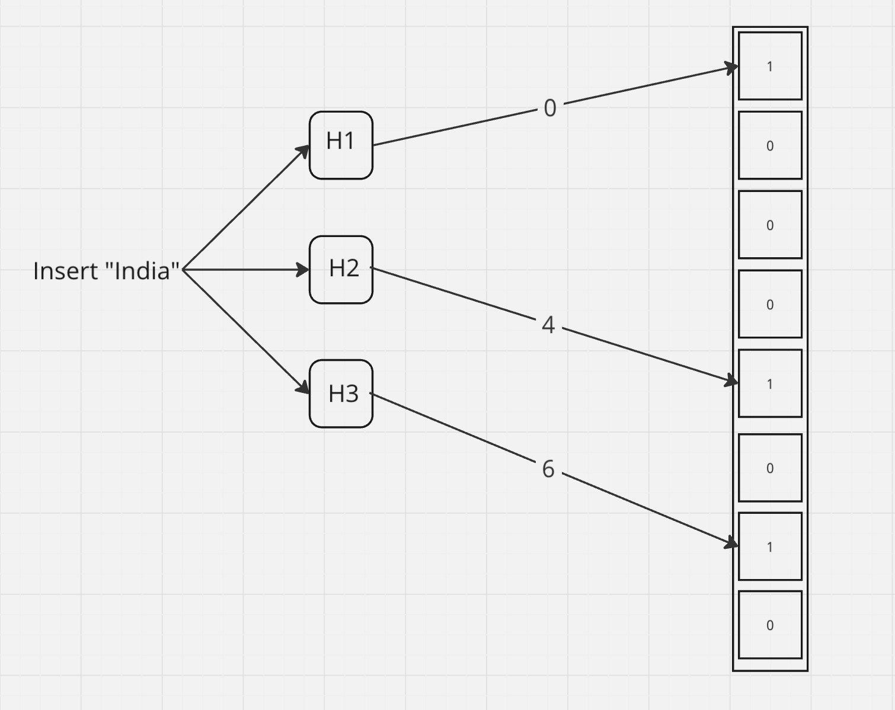
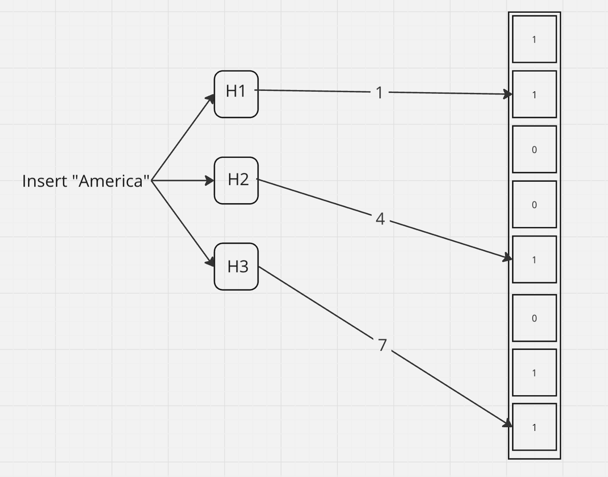
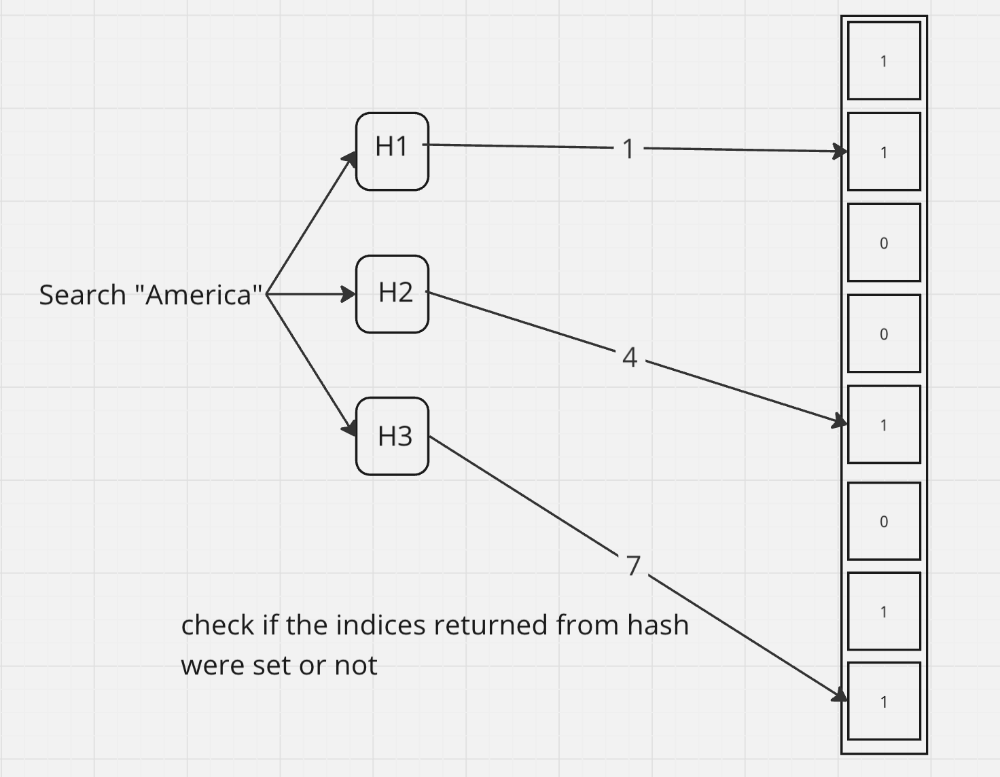
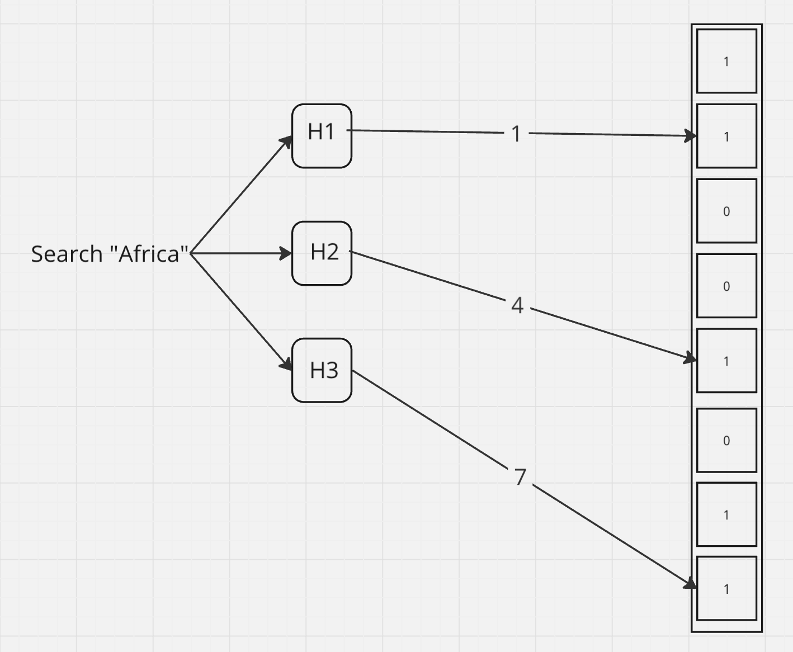

When dealing with large datasets, optimizing memory usage and query performance is crucial. A **Bloom filter** is a space-efficient probabilistic data structure designed for scenarios where memory is limited, and you need to quickly determine if an element is present or not. 

## What is a Bloom Filter?

A Bloom filter is a data structure that allows you to test whether an element is in a set with a small probability of false positives (It may result non existing element as present, but won't return existing element as not present). It operates by using multiple hash functions to map an element to several positions in a bit array. If all the bits at these positions are set to `1`, the element is considered to be in the set; if any of the bits are `0`, the element is definitely not in the set.

## How a Bloom Filter Works

1. **Initialization:**
   - A bit array of a fixed size is initialized, with all bits set to `0`.

2. **Adding Elements:**
   - When adding an element, it is passed through multiple hash functions, each producing an index corresponding to a position in the bit array. The bits at these positions are set to `1`.
   - Here input gets passed through 3 hash functions and returns 3 indices, where bits are set to 1.

     

     

3. **Checking Membership:**
   - To check if an element is in the set, it is hashed again using the same hash functions. If all the bits at the corresponding positions are `1`, the element might be in the set; if any bit is `0`, the element is definitely not in the set.
   - It checks all the indices having set bits and return true.
  
     

4. **False Positives:**
   - Bloom filters can return false positives, where the filter indicates that an element is in the set when it’s not. However, they never return false negatives.
   - Here eventhough Africa is not in the set, and the indices returned by hash functions are already set, it is false positive case.
  
     

   - These FP could be reduced by using proper hash functions, increasing the bucket size, increasing the hash functions and so on.
  
## When not to use BF

- When exact results needed
- When deletion required
- When space efficiency not a concern
- If dataset is small

## Efficiency Compared to Hash Maps

Bloom filters and hash maps are both used for storing and querying sets of data, but they serve different purposes and have different efficiencies:

### Space Efficiency

- **Bloom Filter:** 
  - Uses a fixed-size bit array regardless of the number of elements, making it highly space-efficient. It doesn’t store the actual elements, only a compressed representation.
- **Hash Map:** 
  - Requires significantly more memory as it stores both keys and values, and its size grows with the number of elements. Memory usage increases due to collision handling and storage of actual data.

### Speed

- **Bloom Filter:** 
  - Provides O(1) time complexity for both insertion and membership checks, making it extremely fast. Operations are quick because they involve simple hash calculations and bit manipulations.
- **Hash Map:** 
  - Also offers O(1) time complexity on average, but performance can degrade with poor hash functions or many collisions. Handling collisions adds overhead, especially in large datasets.

### No Data Retrieval

- **Bloom Filter:** 
  - Doesn’t allow retrieval of the actual data, only checks for existence. This makes it unsuitable for applications where you need to retrieve values.
- **Hash Map:** 
  - Stores and retrieves actual key-value pairs, which is essential when you need access to the data itself.

## How Bloom Filters Are Used in Apache Cassandra

Apache Cassandra, a distributed NoSQL database, uses Bloom filters to optimize read performance. In Cassandra, data is stored in tables, and when a query is executed, it needs to search through multiple SSTables (Sorted String Tables) to find the relevant data.

### Reducing Disk I/O

- Cassandra creates a Bloom filter for each SSTable. When a query is executed, instead of scanning all SSTables on disk, Cassandra first checks the Bloom filter to see if the SSTable might contain the requested data.
- If the Bloom filter indicates that the data might be in the SSTable, only then does Cassandra perform a disk read. If the Bloom filter indicates that the data is not in the SSTable, the disk read is avoided entirely.

### Improving Query Performance

- By using Bloom filters, Cassandra minimizes unnecessary disk reads, which are time-consuming. This significantly improves query performance, especially in large datasets where multiple SSTables might be involved.

### Managing Large Datasets

- Cassandra often deals with massive datasets that are distributed across multiple nodes. Bloom filters help efficiently manage these datasets by quickly ruling out irrelevant SSTables, ensuring that only the necessary data is accessed.

## Conclusion

Bloom filters are a powerful tool for optimizing memory usage and speeding up membership checks in large datasets. Compared to hash maps, Bloom filters are more space-efficient and faster in scenarios where only membership testing is required. Understanding and utilizing Bloom filters can lead to significant performance gains in systems handling vast amounts of data.
